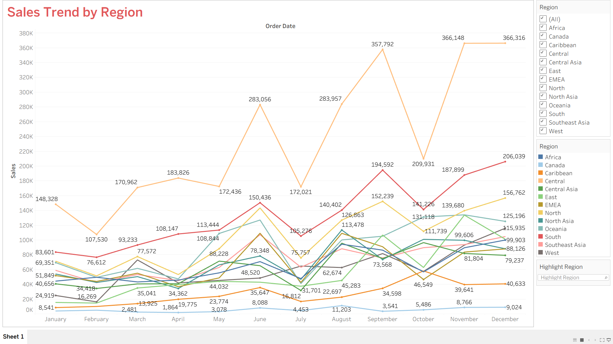
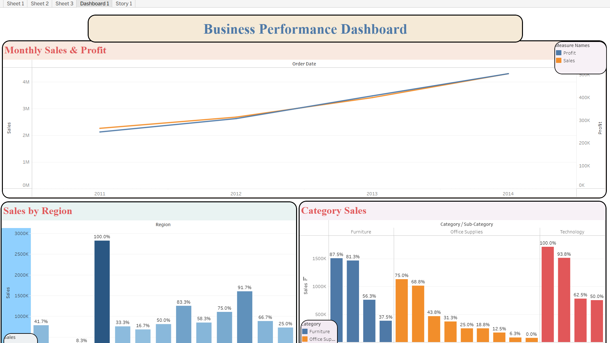

# 📊 Global Superstore Dashboards — Tableau

Interactive sales and business performance dashboards built using Tableau and the Global Superstore dataset.

## 📌 Projects

This repository contains two data visualization projects created using the Global Superstore dataset.

---

# 1️⃣ Sales Trend by Region

## 🎯 Project Overview

This dashboard analyses monthly sales trends across different regions.

The visualization uses a line chart to compare regional sales performance over time and identify patterns, peaks, dips, and differences between regions.

## 📸 Dashboard Preview



## 🔗 Interactive Dashboard

👉 **[View Sales Trend by Region on Vizz](YOUR_VIZZ_LINK_HERE)**

## 📊 Analysis

The dashboard compares sales performance across multiple regions throughout the year. It helps identify high-performing regions, slower-growing regions, and periods of significant sales fluctuations.

The analysis can support decisions related to sales strategies, seasonal planning, inventory management, and marketing activities.

## 🛠️ Tools Used

- Tableau
- Vizz
- Microsoft Excel
- Data Visualization
- Sales Analysis

## 📄 Analysis Report

[View Analysis Report](./01-Sales-Trend-by-Region/analysis-report.pdf)

---

# 2️⃣ Business Performance Dashboard

## 🎯 Project Overview

This interactive dashboard provides a comprehensive overview of business performance by combining multiple visualizations.

The dashboard analyses sales and profit trends, regional sales performance, and category/sub-category sales.

## 📸 Dashboard Preview



## 🔗 Interactive Dashboard

👉 **[View Business Performance Dashboard on Vizz](YOUR_VIZZ_LINK_HERE)**

## 📊 Dashboard Components

### Monthly Sales & Profit
Tracks sales and profit trends over time to identify growth patterns and fluctuations.

### Sales by Region
Compares sales performance across different regions to identify stronger and weaker markets.

### Category & Sub-Category Sales
Analyses sales across product categories and sub-categories to understand which products contribute most to overall sales.

## 🎛️ Interactive Features

The dashboard allows users to explore the data using:

- Region filter
- Category filter
- Date filter

These interactive elements allow users to focus on specific areas of business performance.

## 💡 Business Value

The dashboard helps businesses quickly understand sales and profit trends, compare regional performance, and identify important product categories.

These insights can support data-driven decisions related to sales strategy, regional performance, product planning, and business improvement.

## 🛠️ Tools Used

- Tableau
- Vizz
- Microsoft Excel
- Data Visualization
- Business Analytics

## 📄 Summary Report

[View Summary Analysis](./02-Business-Performance-Dashboard/SUMMARY%20ANALYSIS.pdf)

---

# 📂 Repository Structure

```text
Sales-Dashboard-Portfolio-Tableau/
│
├── 01-Sales-Trend-by-Region/
│   ├── Sales-Trend-by-Region.jpg
│   └── analysis-report.pdf
│
├── 02-Business-Performance-Dashboard/
│   ├── Business-Performance-Dashboard.png
│   └── SUMMARY ANALYSIS.pdf
│
├── Data/
│   └── Global Superstore.xls
│
└── README.md
